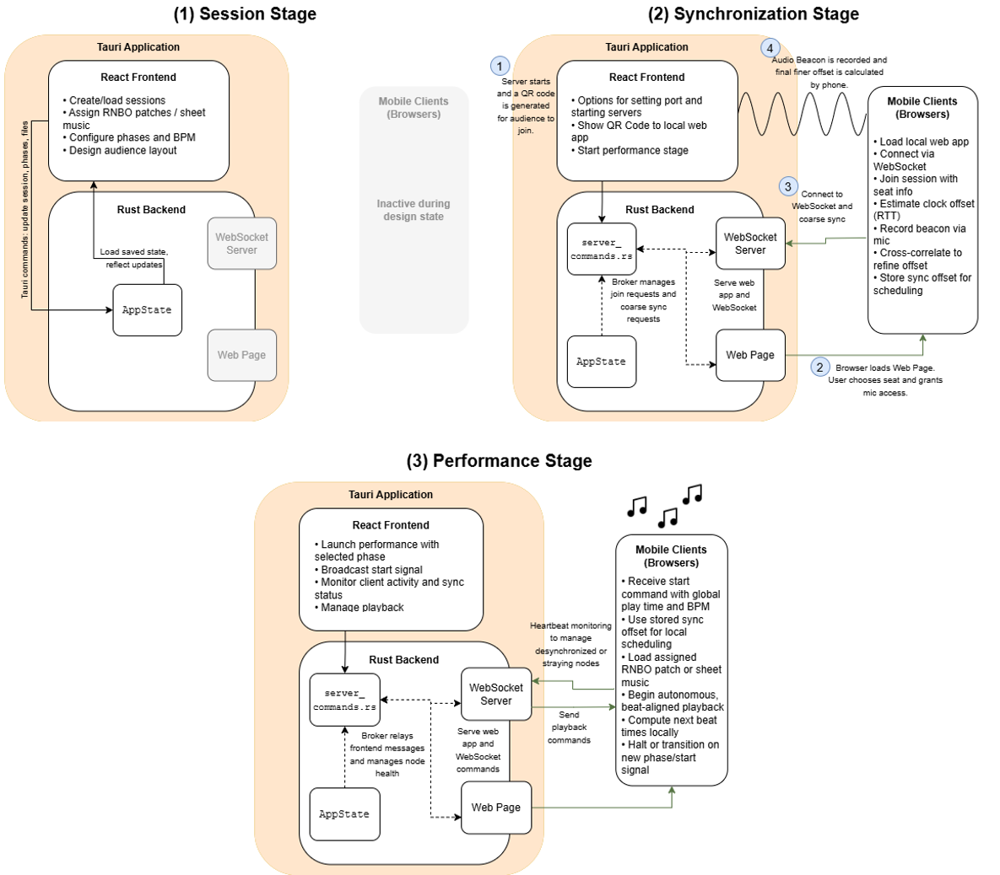
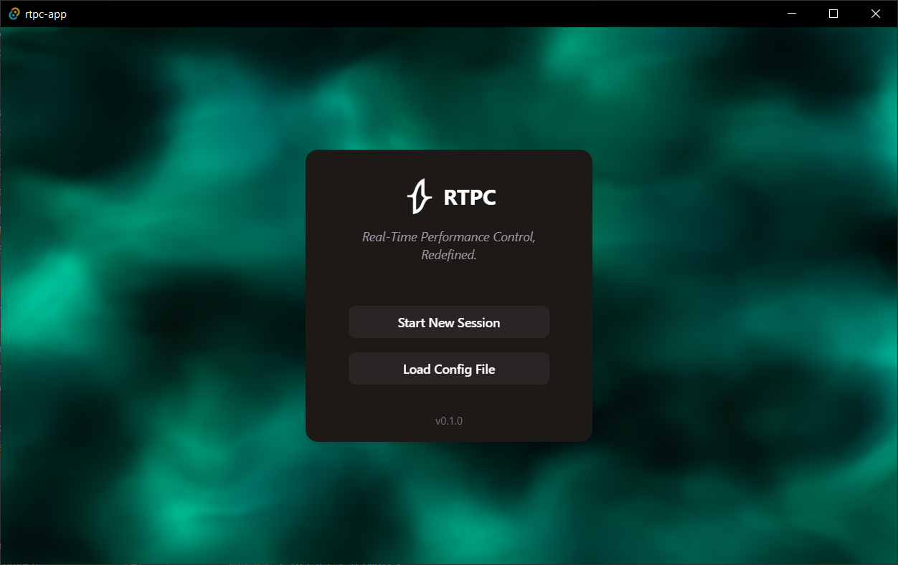
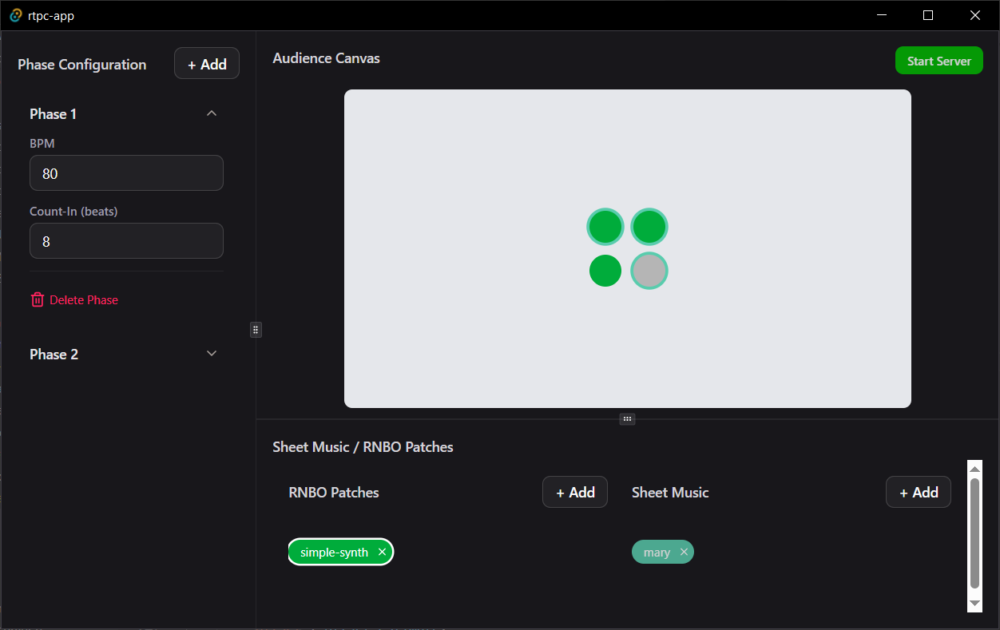
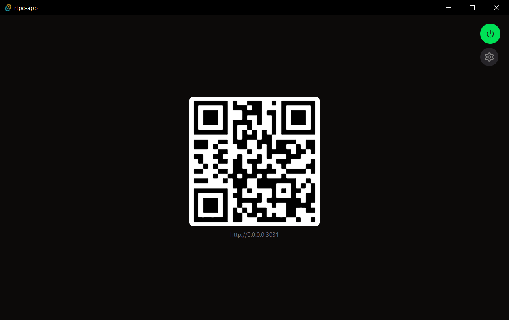
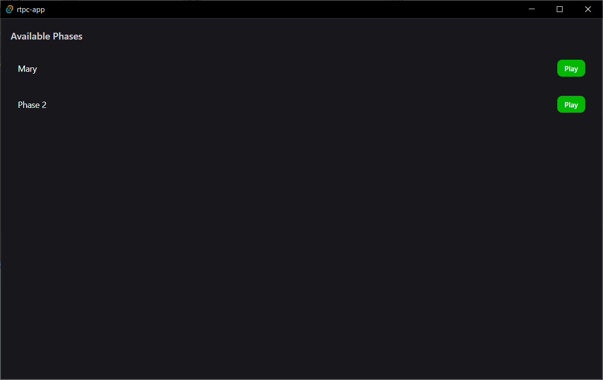
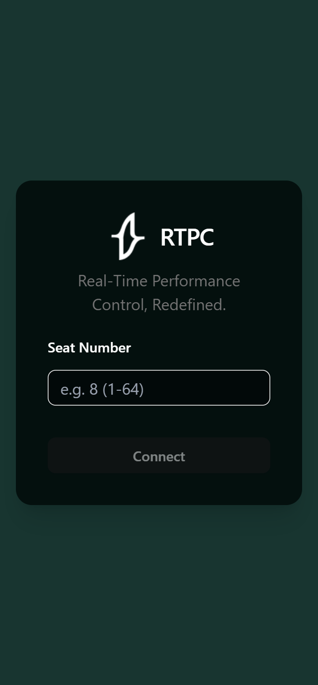
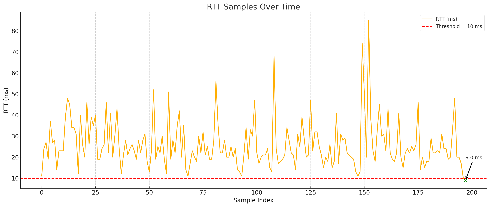
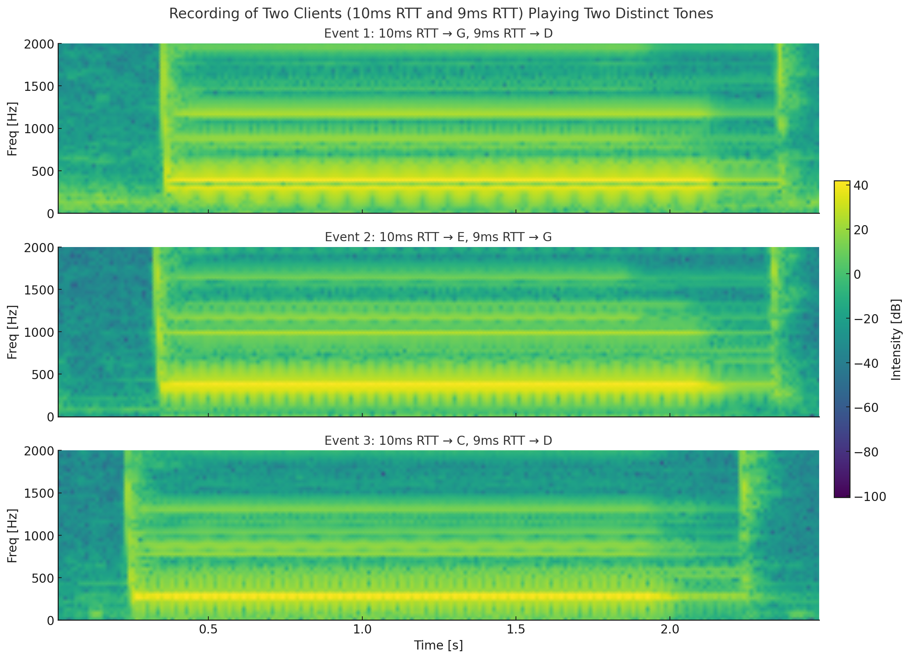

# Real-Time Performance Control in Mobile Node-Driven Sound Diffusion Systems

## Abstract

We present Real-Time Performance Control (RTPC), a system for coordinating beat-aligned sound diffusion across a network of mobile devices in live audio performances. RTPC is built around a modular architecture consisting of a central broker, an administrative interface for performance design and control, and mobile client nodes that operate as distributed playback units. The system employs a two-stage synchronization protocol that was originally designed to combine RTT-based estimation with acoustic beacon alignment using maximum length sequences (MLS) to achieve sub-millisecond clock agreement across clients. However, practical limitations of browser-based audio—specifically unpredictable input latency and inconsistent timing—rendered the beacon-based fine synchronization unreliable in deployment. As a result, RTPC defaults to coarse synchronization using only RTT measurements, which still enables coordinated playback with timing tolerances below 15 ms. Clients connect via browser, preload assigned RNBO patches and sheet music, and compute playback schedules locally using a shared beat grid. RTPC is implemented as a Tauri-based application with a Rust backend and a React frontend, enabling low-latency, hardware-free performance coordination in accessible and portable contexts.

---

## Development Instructions

RTPC is built using [Tauri](https://tauri.app/) and a React frontend. To run the development environment locally:

```bash
npm install
npm update
npm run tauri:dev
```

This will launch the Tauri application, including launching the Tauri administrator application and compiling the client's frontend interface that the application serves.

I also recommend navigating to the frontend directory and running
```bash
npm install
npm update
npm run dev
```
as a sanity check. Then `npm run tauri:dev` should compile a static frontend for the Tauri Application to serve each time you run it. If you'd like to just run the Tauri application without compiling the static files, you can run
```bash
npm run tauri dev
```

This is all assuming you have Tauri and NPM installed, of course.

## Notes on development

### Autocorrelation

While I was unsuccessful in my attempt to run autocorrelation, I've included some proof of concepts. In the `testing_ac`, I included a sample buffer (`buffer.json`) recorded by a device as the acoustic beacon played from the Tauri application. The `reference_mls.json` is the reference signal in the same format as `buffer.json`. The `testing_ac.py` script runs the autocorrelation and shows a notable spike. The spike's index is the offset from start of recording to detection of the signal.

There are some vestigial files throughout the project showing my attempt at autocorrelation as well as some uncommented `useEffects`. However, these shouldn't interfere with the current coarse synchronization method.

### Example RNBO patches and sheets

The application uses its own standard for interpreting sheet music JSON files. An example of these can be found in `example_assets/sheets`. The RNBO patches are MaxMSP-like patches that one can export as portable code, and thus, they are particularly suitable for the task of browser-based audio diffusion.

In `example_assets/devices`, you'll find an additive synthesis instrument exported from Max's official RNBO example library. `bach` and `mary` in sheets are a Bach Prelude and a C major scale, respectively. `mega`, `mega_0`, and `mega_1` are three different overlaying tracks of Toby Fox's Megalovania.

I've also included a script (`example_assets/extract_midi.py`) that will generate a JSON of this format usable by the Tauri application from a MIDI file.

### Local Testing

For local testing or deployment over HTTPS, you'll need a valid SSL certificate. For development or LAN-only setups, you can generate a self-signed certificate using OpenSSL. Keep in mind that modern browsers often reject connections to http:// on mobile when the page is served from a QR code or outside localhost. To get aroudn this, you can run your server with HTTPS and instruct users to click through the "Advanced" warning in their browser when connecting (most will show an option like "Proceed to site anyway" or something along those lines after seeing the cert warning). This should be fine for local demos. 

This step is necessary unless you've installed and trusted your certificate manually on the client device, which is more involved and generally not worth it for short-term usage. 

You can include the `key.pem` and `cert.pem` in `src-tauri/certs`, and also just inside `frontend` (same level as `index.html`).

## Figures

### System Overview
  
**Figure 1:** Diagram of the RTPC system architecture, showing its three-stage lifecycle: session configuration, synchronization, and performance. Each stage highlights the interaction between the Tauri backend, React frontend, and mobile clients.

### Application Interface
  
**Figure 2:** RTPC application start screen where the performer can launch a new session or load a saved one.

  
**Figure 3:** Administrator interface with audience layout, BPM and phase controls, and palette assignment of RNBO patches and sheet music.

  
**Figure 4:** QR code display for mobile client onboarding. Clients use their browsers to connect to the RTPC web session.
  
**Figure 6:** Phase selection screen for starting playback on all connected devices. The play button will immediately start the count-in for the devices to play.

 

**Figure 7:** Mobile client login screen for audience members to enter their assigned seat number and begin synchronization.

### Synchronization Results
  
**Figure 8:** RTT samples over time during coarse synchronization. After 142 samples, RTT stabilized to 9.0 ms, allowing for a coarse synchronization tolerance of 4.5 ms.

  
**Figure 9:** Spectrograms of three playback events recorded from two mobile clients with 10 ms and 9 ms RTTs. Despite slight network differences, tones remain visibly and audibly aligned across all events.

---

## About

This system was developed as part of an undergraduate thesis project at Yale University.

- **Author**: Diego Alderete Sanchez  
- **Advisor**: Dr. Scott Petersen  
- **Department**: Computer Science  
- **Institution**: Yale University  
- **Date**: April 2024

---
